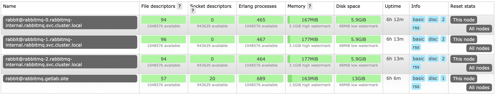
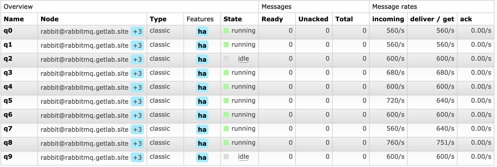

**Задача**: Миграция сервиса RabbitMQ в k8s.

**Цель**: Получить отказоустойчивый и масштабируемый кластер rabbitmq. 

**Что было сделано**: 
- Для изоляции процессов используется отдельный namespace.
- В качестве механизма peer discovery был выбрал один из плагинов [https://github.com/rabbitmq/rabbitmq-peer-discovery-k8s](https://github.com/rabbitmq/rabbitmq-peer-discovery-k8s) для автоматизации процесса поиска пиров. Конфигурация содержится в файле **configmap-rmq.yaml**.

    **cluster_formation.k8s.address_type. З**аменил с дефолтного **ip** на **hostname,** т.к. при рестарте подов ip будут меняться и кластер развалится, в отличии от hostname. StatefulSet гарантирует нам постоянное имя хоста на время жизни всего StatefulSet.

    **cluster_partition_handling.** При потери кворума был выбран механизм **pause_minority,** т.к. нельзя отрицать того, что мы можем потерять часть нод, тем более, если они распределены между стойками и подключены к разным tor или установлены в разных ДЦ. [https://www.rabbitmq.com/partitions.html#automatic-handling](https://www.rabbitmq.com/partitions.html#automatic-handling)

    Для корректной работы плагина и получения FQDN пиров создал роль **rabbitmq-01-rabbitmq-endpoint-reader** для получения данных с api server со следующими правами:

        rules:
        - apiGroups: [""]
          resources: ["endpoints"]
          verbs: ["get"]

    Полная конфигурация содержится в **rbac-rmq.yaml**

- Т.к. мы не хотим терять данные, которые могут записываться на диск, разработчики рекомендуют использовать StatefulSet. Выжимка из документации "A RabbitMQ cluster deployed to Kubernetes will use a set of pods. The set must be a stateful set."  [https://www.rabbitmq.com/cluster-formation.html#peer-discovery-k8s](https://www.rabbitmq.com/cluster-formation.html#peer-discovery-k8s). Сама конфигурация содержится в файле **statefulset-rmq.yaml.**
- В качестве updateStrategy был выбран RollingUpdate. [https://kubernetes.io/docs/tutorials/stateful-application/basic-stateful-set/#updating-statefulsets](https://kubernetes.io/docs/tutorials/stateful-application/basic-stateful-set/#updating-statefulsets) 
[https://www.rabbitmq.com/upgrade.html](https://www.rabbitmq.com/upgrade.html)
- Для бесперебойной миграции данных в кластер была настроена политика ha-mode all для репликации очередей по всем нодам. [https://www.rabbitmq.com/ha.html](https://www.rabbitmq.com/ha.html)
В дальнейшем, при использовании кластера рекомендуется создавать репликацию с помощью [https://www.rabbitmq.com/quorum-queues.html](https://www.rabbitmq.com/quorum-queues.html)
- Для тестов сервиса использовал simple-publisher и simple-consumer
Ключи для запуска:

    	  --h string   rabbitmq host:port (default "127.0.0.1:5672")
          --p string   rabbitmq password (default "guest")
          --q int      number of queues (default 10)
          --t int      timeout
          --u string   rabbitmq user (default "guest")

**Итог**: Для бесперебойной миграции rabbitmq объединил 2 кластера (vpc и k8s), реплицировал очереди с помощью политики ha-mode all, вывел кластер vpc из работы без потери данных.

